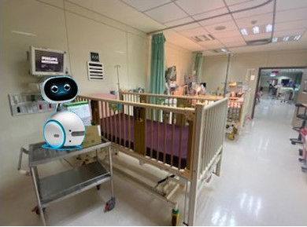
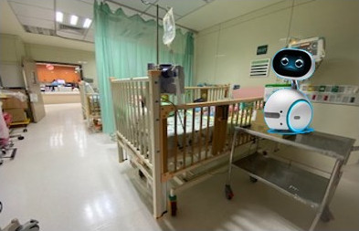

#### Introduction

This is the development for the ZenboNurseHelper Project on the Windows platform. For more details of the ZenboNurseHelper Project, please visit [Link](http://github.com/yangchihyuan/ZenboNurseHelper). Because the Windows platform only affects the server-side program, this git repo currently does not contain the Android folder. Most files in the cpp folder are the same as their Linux version. The major difference lies in how to build the projects, and the README.md in the cpp folder explains the details. 

