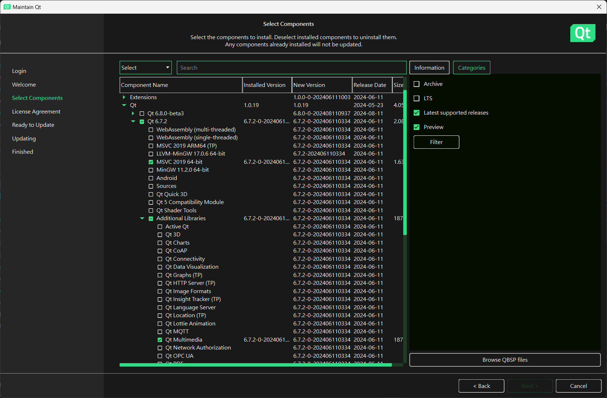

This folder contains the code files for the server-side program of ZenboNurseHelper for the Windows platform. It provides an Graphic User Interface (GUI) for a user to remotely control the robot's action. The GUI currently looks like the image below and allows a user to send commands to the robot-side's app, which calls Zenbo SDK to execute those commands.


In this project, we utilize Intel OpenVINO's human_pose_estimation_demo in their Open Model Zoo 2024 demos as a tool to guide our Zenbo robot. Our server-side program receives frames transmitted from the robot-side app, estimates human pose landmark coordinates, and reports the results to the robot-side program.

# OpenVINO Setting
Please download the Intel OpenVINO 2024.3's Windows archive [(Link)](https://www.intel.com/content/www/us/en/developer/tools/openvino-toolkit/download.html?PACKAGE=OPENVINO_BASE&VERSION=v_2024_3_0&OP_SYSTEM=WINDOWS&DISTRIBUTION=ARCHIVE). There are many ways to install OpenVINO, and for our case, we should use the archive file because it contains a setupvars.bat file, which is required by the open_model_zoo demo code. Suppose the name of the downloaded archive file is w_openvino_toolkit_windows_2024.3.0.16041.1e3b88e4e3f_x86_64.zip. Open it using your File Explore, and unzip the file. You should get a folder w_openvino_toolkit_windows_2024.3.0.16041.1e3b88e4e3f_x86_64. Rename it to OpenVINO and copy the OpenVINO to your home folder, which is usually C:\Users\\<your_user_name>, and you will have a new folder C:\Users\\<your_user_name>\OpenVINO. Then, you can delete the downloaded zip file w_openvino_toolkit_windows_2024.3.0.16041.1e3b88e4e3f_x86_64.zip.

## Install Git for Windows
Please download Git for Windows from this [(Link)](https://git-scm.com/download/win). There is no significant difference between the 32-bit and 64-bit versions. We suggest using the 64 bit version. There are many options available when you install Git for Windows. If you do not know how to choose them, it is enough for us to use the default ones.

## Download open_model_zoo sample code
Launch the CMD (command line) program and download the open_model_zoo code by
```sh
cd %userprofile%
git clone --recurse-submodules https://github.com/openvinotoolkit/open_model_zoo.git
```
We need a pretrained model human-pose-estimation-0001.xml and its bin file used in the human_pose_estimation_demo, which is a part of the OpenPose algorithm.
To download the model, we use a Python tool package omz_tools, whose installation instruction is a part of the open_model_zoo. See [(Link)](https://github.com/openvinotoolkit/open_model_zoo/blob/master/tools/model_tools/README.md).
However, Windows 11 does not contain a Python program by default. If you do not have Python installed, please follow the instruction below.

## Install Python
First, do not install the Python program provided by the Windows Store, which will install the Python program in your personal folder such as C:\Users\\<your_user_name>\AppData\Local\Packages\PythonSoftwareFoundation.Python.3.12_qbz5n2kfra8p0. The length of the folder is very long in terms of the full path. When you install the omz_tools, the process will halt because omz_tools contains some files whose path and file names are too long to be install on a Windows system. By default, Windows only allows 256 characters for a file's full length. Although this setting is adjustable, we do not want to modify it.   

We suggest installing the Python program from Python Foundation's setup file [(Link)](https://www.python.org/downloads/). Regarding the version, we suggest 3.12.5 because it is the newest and stable one. When you install Python, choose the Customize installation and check the "Add python.exe to PATH".


In this page, mark this checkbox "Install Python 3.12 for all users" to make the folder length shorter.


At the end of the installation process, will see you an option to disable path length limit.


If you are a system manager, do it and you will not be bothered by the path length limit.
If your CMD window for downloading the open_model_zoo code is still open, close it and re-launch the CMD program to because python.exe is just added into the PATH environment variable.
After installing Python, you can follow open_model_zoo's installation instructions to install the setuptools package.
```sh
pip install setuptools
```
And the the openvino-dev package.
```sh
pip install openvino-dev
```
Navigate to the open_model_zoo\tools\model_tools directory, and install the omz_tools package
```sh
cd %userprofile%\open_model_zoo\tools\model_tools
pip install .
```
After installing the model_tools package, use this command to download the human-pose-estimation models from a file server.
```sh
python %userprofile%\open_model_zoo\tools\model_tools\omz_downloader.py --list %userprofile%\open_model_zoo\demos\human_pose_estimation_demo\cpp\models.lst -o %userprofile%\open_model_zoo\models
```
It will download 23 files saved in ~/open_model_zoo/models/intel and ~/open_model_zoo/models/public although we only need 2 of them. However, this command is better than the Intel's instruction "omz_downloader --all" because it will download a lot of files and take a long time.

# Install Our Files
Suppose your Open Model Zoo is installed in ~/open_model_zoo.
Please git clone this repository into the demos directory.
```sh
cd %userprofile%\open_model_zoo\demos
git clone https://github.com/yangchihyuan/ZenboNurseHelper_Windows.git
```

# Install Visual Studio 2019
We need a compiler and a linker for our project, and OpenVINO 2024.3 suggest using Visual Studio 2019. Be aware, it does not support Visual Studio 2022 until now. However, Microsoft has treated Visual Studio 2019 as an out-of-life-cycled product and removed the downloaded link. We use a third-party software repository to download the Visual Studio 2019 from this [(Link)](https://www.techspot.com/downloads/7241-visual-studio-2019.html). The free Community Edition is enough for our project. When installing it, you need to mark the checkbox "Using C++ for desktop development".


# Install CUDA
A GPU will greatly shorten the computational time for the voice recognition program Whisper.cpp used in our program. If your computer is equipped with an NVidia GPU, you need to install CUDA to enable Visual Studio 2019's capacity to use it.
You can download the latest CUDA Toolkit from this [(Link)](https://developer.nvidia.com/cuda-downloads). 

# Install Dependencies
## vcpkg
The vcpkg program is Windows' package management tool for C++ libraries. It is a convenient way to install Protocol Buffer, which we use to pass messages from our server program to the Android app. 
Use these commands below to download the source code of vcpkg, and its tutorial is available at [(Link)](https://learn.microsoft.com/zh-tw/vcpkg/get_started/get-started-vs?pivots=shell-cmd).

```sh
cd %userprofile%
git clone https://github.com/microsoft/vcpkg.git
```
Execute the boostrap-vcpkg.bat file, which will download an executable file vcpkg.exe into your vcpkg file.
```sh
cd vcpkg && bootstrap-vcpkg.bat
```

## Protocol Buffer 
Use the command to install Protocol Buffer after you install vcpkg. 
```sh
cd %userprofile%\vcpkg
vcpkg install protobuf protobuf:x64-windows
```
It will install not only protobuf but also many dependencies such as CMake, abseil-cpp, utf8-range, PowerShell, 7zip, and MinGW-w64. 

## OpenCV
OpenCV is a required library for the open_model_zoo's human_pose_estimation demo, and we use it to show images captured by the Zenbo robot's camera.
To install it, please download the installation execute file for Windows from OpenCV official website [(Link)](https://opencv.org/releases/). The downloaded exe file is a self-unzip file. Unzip it to your %userprofile% folder, and you should get a subfolder opencv in your %userprofile% folder.

Alternatively, you can use vcpkg to install OpenCV.
```sh
cd %userprofile%\vcpkg
vcpkg install opencv
```
However, there are two disadvantages. First, OpenCV's official website's version is relatively newer than the one installed by vcpkg, for example 4.10 vs 4.8. Second, OpenCV is a huge library with several dependencies such as zlib, libpng, libjpeg-turbo, libwebp, tiff, tiny-dnn. As a result, it takes a while for vcpkg to build all files. If you do not want to wait, do not use vcpkg to install OpenCV.

## libgflags
It is a tool library to help us parse command arguments. To install it, use
```sh
cd %userprofile%\vcpkg
vcpkg install libgflags-dev
```
It will install libgflags 2.2.2-2.

## Qt 
We use Qt to create our GUI. To install Qt, you need to not only download the installation file from Qt's website [(Link)](https://www.qt.io/download-dev) and register for a license, which is free and necessary when you install Qt.
There are several Qt components for different platforms. Please only mark the MSVC 2019 64-bit and unmark all other platforms. Otherwise, you will use 40 Gb disk space for other platforms. Among the additional libraries, please mark Qt Multimedia because our program uses it. 



### Hint
The Qt base and multimedia libraries allow you to compile this project. However, they do cover Qt Creator, a convenient tool to create the GUI file mainwindow.ui. If you want to install Qt Creator, you need to mark its checkbox.


## PortAudio 
We use it to play voice on the server transmitted from the Android app and received from the robot's microphone.
There is no package made for the Ubuntu system, and we need to compile it from downloaded source files, which are available on its GitHub page
```sh
cd %userprofile%\vcpkg
git clone https://github.com/PortAudio/portaudio.git
```
There is an instruction page teaching how to compile and install PortAudio [(Link)](https://www.portaudio.com/docs/v19-doxydocs/compile_windows.html). however, it was edited 10 years ago and outdated. Let's clarify our steps here. (1) we do not need DirectX, so we do not need to install the DirectX SDK. (2) we do not use ASIO in our program, so we do not need to install the ASIO library. (3) we use Visual Studio 2019 to build PortAudio, and there is no instruction steps for Visual Studio 2019. We found that the instruction written for Visual Studio 2010 does not work for 2019, i.e. opening the sln file in the build\msvc folder did not work. Even though Visual Studio 2019 can convert the old sln file into a new format, there are error messages when you build the solution. Thus, to build PortAudio, we use CMake, which is supported by Visual Studio 2019. To do it, use Visual Studio 2019 to open the folder C:\Users\\<your_user_name>\portaudio which contains a CMakeLists.txt file. Visual Studio will automatically configure the CMake file. Different from the sln file which contains 4 configurations (32-bit and 64-bit, Debug and Release), there is only 1 configuration in the CMake file (x64-Debug). However, it is enough for us. Once the CMake file is loaded by Visual Studio 2019, just click build-->build all on the menu or press Ctrl+Shift+B. In the Output Panel, you will see a message that two files are built: portaudio_static_x64.lib and portaudio_x64.dll. They are in the folder C:\Users\\<your_user_name>\portaudio\out\build\x64-Debug.

## CUDA
Whisper.cpp is an voice-to-text library and we utilize it on our server-side program to quickly generate sentences from voice spoken out by an operator, which will be sent to the Zenbo robot to speak out. Because whisper.cpp runs slowly if it only uses CPUs, it is best to use a GPU to accelerate its computation.
If your computer is equipped with an NVidia GPU, you need to install CUDA toolkit to enable the GPU program compilation.
CUDA is free available at NVidia's official website [(Link)](https://developer.nvidia.com/cuda-downloads). 

## whisper.cpp
To use whisper.cpp, we need to compile it from its source files, which are available from from its GitHub repository
```sh
cd %userprofile%
git clone https://github.com/ggerganov/whisper.cpp.git
```
There are several ggml models (from tiny to large) listed on the whipser.cpp webpage. The larger the model size, the slower the speed, but the more accurate the converted sentence. We suggest using the base model as a balance between speed and accuracy. If the language you want to convert is not English, use the base model rather than the base.en one.
```sh
cd %userprofile%\whisper.cpp
call models\download-ggml-model.cmd base
```
It will download ggml-base.bin from the HuggingFace website.
To build whipser.cpp, we use Visual Studio 2019's CMake support, like the way we do for portaudio. Launch Visual Studio 2019, and then open the folder C:\Users\\<your_user_name>\whisper.cpp. Visual Studio 2019 will automatically recognize the CMakeLists.txt file in it. Next, click the build button, whisper.dll will be created in this folder C:\Users\\<your_user_name>\whisper.cpp\out\build\x64-Debug\bin

Notification: whisper.cpp files contain a few unicode characters, which is incompatible with BIG5, the default encoding system of Windows 11 Traditional Chinese Edition. If that is your Windows 11 edition, you need to turn on the support of Unicode UTF-8. However, it will make some programs unable to work, such as the VBA in an Access database, and some programs written in BIG5.


# Compile and Run
Run the OpenVINO's build_demos.cmd in C:\Users\\<your_user_name>\open_model_zoo\demos to build this project, and an executable file 9_NurseHelper should be created at C:\Users\\<your_user_name>\omz_demos_build\intel64\Release
To make it easy, we make a build_demos_Windows.cmd file in the working directory C:\Users\\<your_user_name>\open_model_zoo\demos\ZenboNurseHelper\cpp
```sh
cd %userprofile%\open_model_zoo\demos\ZenboNurseHelper\cpp
build_demos_Windows.cmd
```
This command will build all open_model_zoo's demos, including our ZenboNurseHelper. After make the execute file 9_NurseHelper, execute the command to launch it.
```sh
cd %userprofile%\open_model_zoo\demos\ZenboNurseHelper\cpp
run_on_Windows.cmd
```

# Known problems and workarounds
## whisper.cpp only uses the CPU rather than a GPU
Even though we set the parameter cparams.use_gpu = true, whisper.cpp still does not use the GPU. As a result, the voice recognition runs slowly. We find an open issue on the whisper.cpp GitHub repository [(Link)](https://github.com/ggerganov/whisper.cpp/issues/2214) mentioning this problem, but no solution is available.

## crash problem
When we launch the robot-side app and connect to the server-side program. Our program always crashes. We have not yet found a debugger on Windows to deal with the problem.